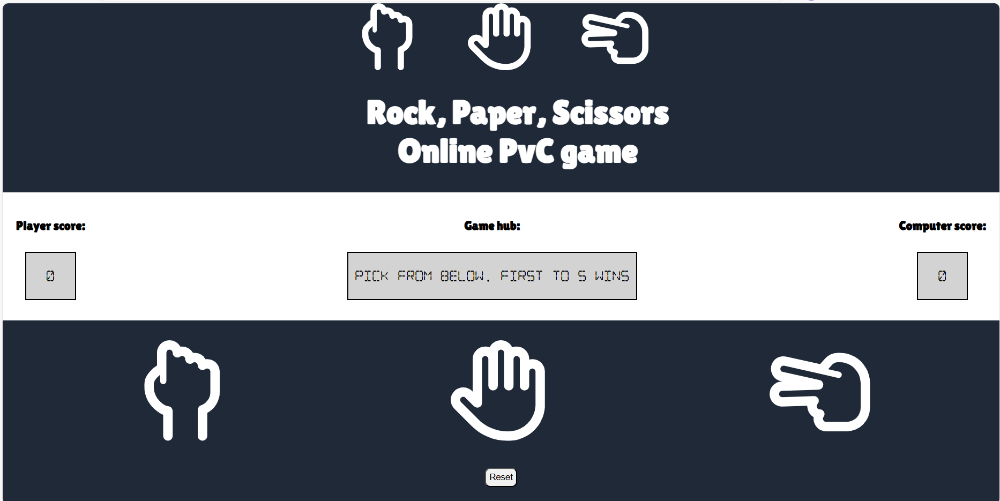

  

<h3 align="center">project_title</h3>

  

    Welcome to the Rock-Paper-Scissors online game! This classic hand game is usually played between two people, where each player simultaneously forms one of three shapes with an outstretched hand. The possible shapes are "rock" (a fist), "paper" (an open hand), and "scissors" (a fist with the index and middle fingers extended, forming a V).

The rules are simple:

Rock crushes Scissors Scissors cuts Paper Paper covers Rock The objective is to select a shape that defeats the shape chosen by the opponent computer, first to 5 wins. GLHF
     
    <a href="https://github.com/hossam-allam/rock-paper-scissors"><strong>Explore the docs »</strong></a>
     
     
    <a href="https://hossam-allam.github.io/rock-paper-scissors/">View Demo</a>

  

